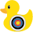
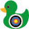

# CSS-to-the-rescue

Week 1: opdracht keuze en idee.
Ik heb gekozen voor een console panel voor de opdracht.
Mijn idee is om een spel te maken in de vorm van een duck shooter van een kermis.
- Er komen dan 3 lagen met verschillende groten eendjes
- De eenden bewegen heen en weer.
- misschien is er een knop om de doelwitten de versnellen om het moeilijker te maken.
- je gebruikt je muis door te klikken op de doelwitten om erop te "schieten".
- Er moet een teller zijn of een ander beeld, dat laat zien hoeveel punten er gescoord zijn of wat de prijs is.

Inspiratie heb ik van het plays.org spel: duck shoot
<a>https://plays.org/duck-shoot/</a>

met verschillende doelwitten niet alleen eenden en ook doelwittend die niet geraakt mogen worden, of die meer punten geven.

Week 2: Oefenen met animaties en de transform.
Ik ben deze week begonnen in CodePen met de animatie van de de doelwitten die heen en weer bewegen, het omvallen van de doelwitten als erop geklikt wordt. Hier is de collectie te zien van alle oefeningen.
https://codepen.io/collection/RPPqYx

De animatie heb ik gemaakt met keyframes zoals hieronder te zien.

Deze animatie zorgt ervoor dat de doelwitten heen en weer bewegen, op 50% draaien en op 100% weer terug draaien en dat allebei buiten beeld.
Ook zijn de doelwitten input type radio. Dit zorgt ervoor dat wanneer de doelwitten geraakt worden deze omvallen en niet nog een keer geklikt kunnen worden.

De doelwitten kunnen alleen gereset worden met de reset knop onderaan het scherm.

Ik heb ook in illustrator de eendjes gemaakt met een doelwit erop en deze in twee verschillende kleuren.

 

Tot nu toe ziet het er zo uit en bewegen de twee fieldsets op verschillende snelheden heen en weer.

Volgende week wil ik beginnen met uitzoeken hoe ik een counter kan maken voor hoeveel doelwitten er geraakt zijn.
en misschien beginnen aan het ontwerp van de rest van het kraampje van het spel.

Week 3: Counter, oude mannen knop, kraampje.....

Onderzoek:
https://www.hongkiat.com/blog/count-html-state-change/

https://developer.mozilla.org/en-US/docs/Web/CSS/CSS_counter_styles/Using_CSS_counters

https://codepen.io/una/pen/NxZaNr?editors=1100

Nils kwam met het idee om de eendjes een klein beetje op en neer te laten gaan, naast dat ze heen en weer bewegen. Hij had hier een voorbeeld van 
die hij gemaakt had op 9elements, waarbij hetzelfde gebeurde met een vogel.
https://9elements.com/blog/speed-vs-duration-a-use-case-for-mixed-unit-division/

https://codepen.io/enbee81/pen/xxNzJem 

Ik heb toen gekeken naar de codepen welke delen nodig waren voor het op en neer gaan en derest verwijdert en toen in een andere codepen gekeken hoe dat bij mijn html en css aansluit. 
https://codepen.io/Jamie-Hart/pen/azbLZGM?editors=1100 

Ik moest een aantal dingen aanpassen zoals de variables: amplitude( Deze heb ik lager gemaakt zodat de beweging kleiner werd en, nu binnen de fieldset bleef), de variable voor de top van de eenden( Zodat deze boven bleven en de onderste rij niet bij het console uitsteekt tijdens de beweging)

En omdat ik de animatie van op en neer gaan in de label css had gezet, ging mijn oude mannen knop ook op en neer wat natuurlijk niet de bedoeling is. Dus moest ik voor div label {} animatie op none zetten en omdat de top die stond in label {} ook invloed had op de positie ervan moest ik de top zetten op 0.25em, zodat deze weer gelijk stond met de andere vakjes in de console. 

Het enige wat jammer is is dat de eendjes niet apart op en neer gaan, maar ze gaan allemaal tegelijk op en neer.

Verder ben ik gaan werken aan het ontwerp van het kraampje. Met behulp van Gradients heb ik gordijnen gemaakt die aan de zijkant hangen en pilaren die aan de buitenkant staan om het dak omhoog te houden.

Tot nu toe zweven de eendjes nog over het scherm. Ze zitten nergens aan vast en bewegen los in de lucht. Ik moet dus nog bedenken hoe ik deze ga verbinden of dat ik ze ergens op ga neerzetten zoals de inspiratie, waarbij ze op water drijven.

Ik heb mijn zus het spel laten spelen en toen ging ze heel wild klikken op de eendjes en selecteerde ze steeds de img, dus heb ik user-select in css op none gezet zodat dat niet meer kan. 

Aan het eind van week 3 ziet mijn werk er als volgt uit.

Volgende week(de laatste week) ga ik kijken hoe ik een timer kan toevoegen en dat er een scherm komt, dat aangeeft hoeveel punten er gescoord zijn binnen een bepaalde tijd.

