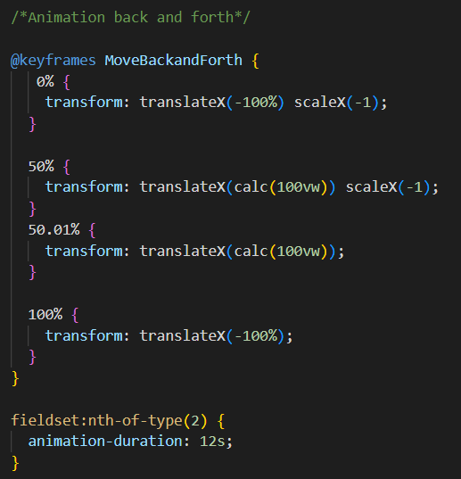
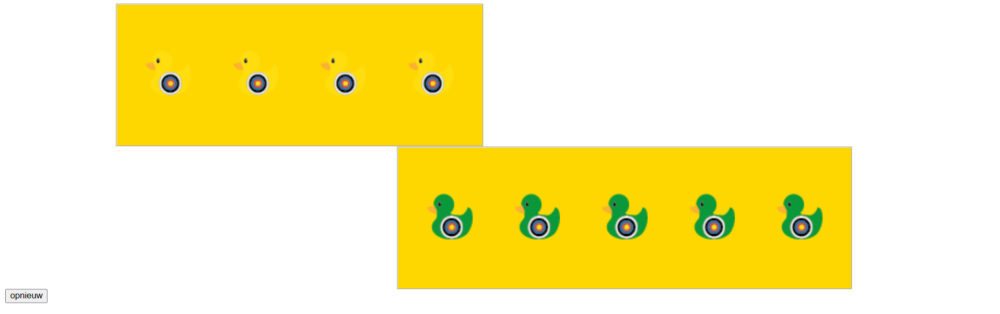

# CSS-to-the-rescue

Week 1: opdracht keuze en idee.
Ik heb gekozen voor een console panel voor de opdracht.
Mijn idee is om een spel te maken in de vorm van een duck shooter van een kermis.
- Er komen dan 3 lagen met verschillende groten eendjes
- De eenden bewegen heen en weer.
- misschien is er een knop om de doelwitten de versnellen om het moeilijker te maken.
- je gebruikt je muis door te klikken op de doelwitten om erop te "schieten".
- Er moet een teller zijn of een ander beeld, dat laat zien hoeveel punten er gescoord zijn of wat de prijs is.

Inspiratie heb ik van het plays.org spel: duck shoot
<a>https://plays.org/duck-shoot/</a>

met verschillende doelwitten niet alleen eenden en ook doelwittend die niet geraakt mogen worden, of die meer punten geven.

Week 2: Oefenen met animaties en de transform.
Ik ben deze week begonnen in CodePen met de animatie van de de doelwitten die heen en weer bewegen, het omvallen van de doelwitten als erop geklikt wordt. Hier is de collectie te zien van alle oefeningen.
https://codepen.io/collection/RPPqYx

De animatie heb ik gemaakt met keyframes zoals hieronder te zien.

Deze animatie zorgt ervoor dat de doelwitten heen en weer bewegen, op 50% draaien en op 100% weer terug draaien en dat allebei buiten beeld.
Ook zijn de doelwitten input type radio. Dit zorgt ervoor dat wanneer de doelwitten geraakt worden deze omvallen en niet nog een keer geklikt kunnen worden.

De doelwitten kunnen alleen gereset worden met de reset knop onderaan het scherm.

Ik heb ook in illustrator de eendjes gemaakt met een doelwit erop en deze in twee verschillende kleuren.

 

Tot nu toe ziet het er zo uit en bewegen de twee fieldsets op verschillende snelheden heen en weer.

Volgende week wil ik beginnen met uitzoeken hoe ik een counter kan maken voor hoeveel doelwitten er geraakt zijn.
en misschien beginnen aan het ontwerp van de rest van het kraampje van het spel.

Week 3: Counter for radio input.

Onderzoek:
https://www.hongkiat.com/blog/count-html-state-change/
https://developer.mozilla.org/en-US/docs/Web/CSS/CSS_counter_styles/Using_CSS_counters
https://codepen.io/una/pen/NxZaNr?editors=1100
